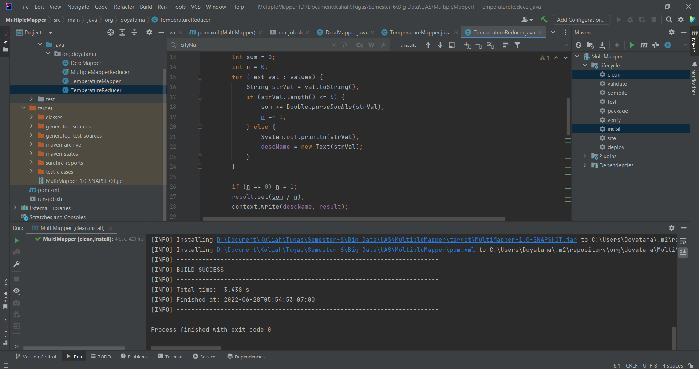

# Study Kasus

Cek rata-rata Climate Change: Earth Surface Temperature Data dengan multiple mapper pada mapreduce

## Data Link

### https://www.kaggle.com/datasets/berkeleyearth/climate-change-earth-surface-temperature-data

## Video Link

### https://youtu.be/JFGWvI1_RX8

# Screenshot hasil

## Status dari JPS VM setelah menjalankan hdfs

## Saat melakukan maven verify and install

## Ketika menjalankan mapreduce job dan success

## Menampilkan result pada hadoop dashboard di port 9870

## Hasil dari test API spring boot pada postman

## Menampilkan data pada website dengan teknologi react js

